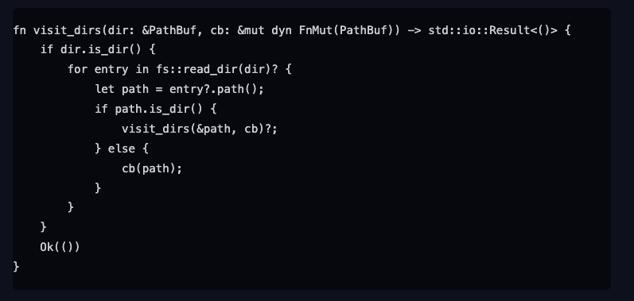
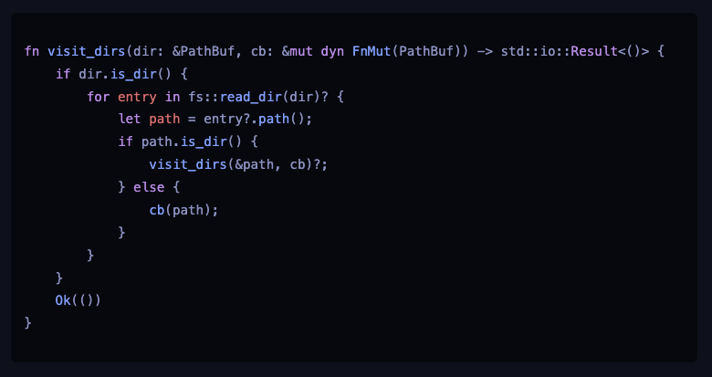

If you have used Tailwind's Typography plugin to style Markdown text, you may have seen the plain default code block styles:




It didn't look well to me, particularly in dark mode where the page may suffer from low contrast..

## HighlightJS

I use [pulldown-cmark](https://github.com/raphlinus/pulldown-cmark) crate for my markdown parser and initially I sought first-party support or an extension for syntax highlighting within this tool.

One [Github issue](https://github.com/raphlinus/pulldown-cmark/issues/167) did offer some community solutions. However, these approaches tended to complicate the code, requiring modifications to the event stream before it's passed to push_html

Then I found out the center focus of this post, `Highlight JS` where it offers the out of the box solution where we do not have to modify the output for markdown parser. Integration is as simple as linking a script to the HTML body.

You can find the complete list of available styles [here](https://github.com/highlightjs/cdn-release/tree/main/build). For a preview of each style, visit [this demo page](https://highlightjs.org/demo).


## Typography

Since I'm relying on client side rendering for the syntax highlighting, the following 4 steps needs to be done.

1. Adding the Script to the HTML Document

We have the choice to add `highlight.min.js` either to the `<head>` or just before the closing `</body>` tag in your HTML. The placement depends on your specific needs. Typically, scripts are placed just before the closing `</body>` tag for better page load performance.

2. Including the Stylesheet

`highlight.js` requires a style sheet for the syntax highlighting to work. You can include one of the [many](https://github.com/highlightjs/cdn-release/tree/main/build/styles) styles provided by `highlight.js`.

3. Add more language support if `highlight.min.js` does not have the corresponding module built in.

The default `highlight.min.js` might not include all language modules. Use `hljs.listLanguages()` to check the available languages. If your desired language isn't listed, you can load it separately.

4. Initializing `highlight.js`

After your page has loaded, you need to initialize `highlight.js`. This can be done by adding a script to call `hljs.highlightAll()`, which will wait for the DOM to be fully loaded before applying the highlighting.

> **_NOTE:_** To enable `highlight.js` for your code blocks, ensure that `tailwind-css` has appropriately assigned the relevant classes to the HTML code blocks.

Here is the full code that I used in my blog:

```rust
use leptos::*;
use leptos_meta::*;

/// https://github.com/highlightjs/cdn-release/tree/main/build
#[component]
pub fn HighlightScript() -> impl IntoView {
    view! {
        <Script
            type_="text/javascript"
            src="https://cdn.jsdelivr.net/gh/highlightjs/cdn-release@latest/build/highlight.min.js"
        />
        <Link
            rel="stylesheet"
            href="https://cdn.jsdelivr.net/gh/highlightjs/cdn-release@latest/build/styles/base16/material-palenight.min.css"
        />
        <Script
            type_="text/javascript"
            src="https://cdn.jsdelivr.net/gh/highlightjs/cdn-release@latest/build/languages/dockerfile.min.js"
        />
        <Script>
            document.addEventListener("DOMContentLoaded", (event) => {
                hljs.highlightAll();
            });
        </Script>
    }
}
```

## Outcome

With all the change above, the code block now looks like this.



And there you have it, happy coding!
